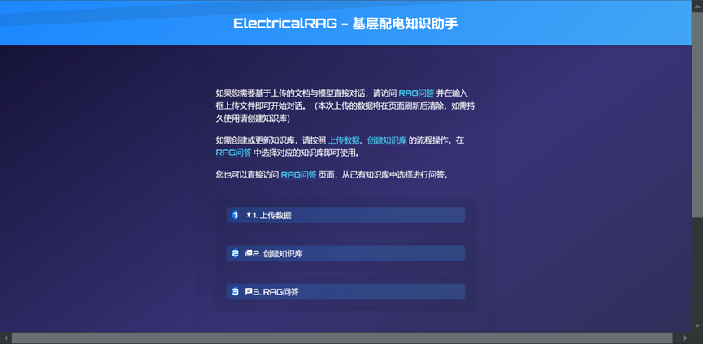
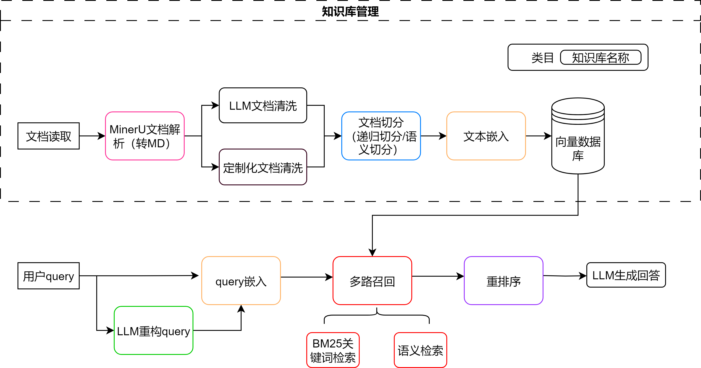
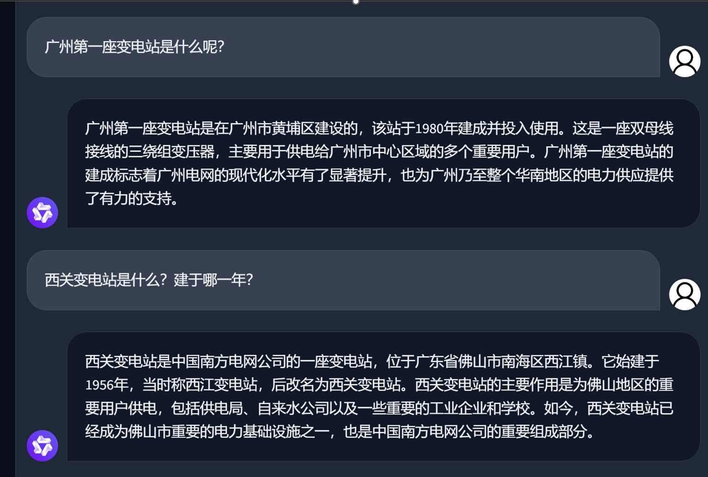
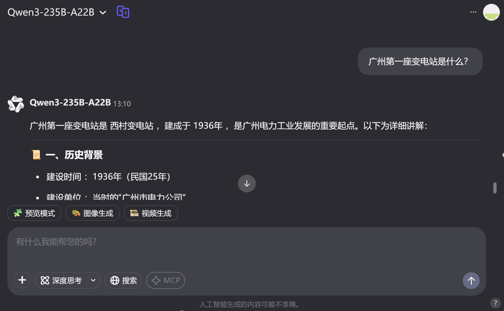
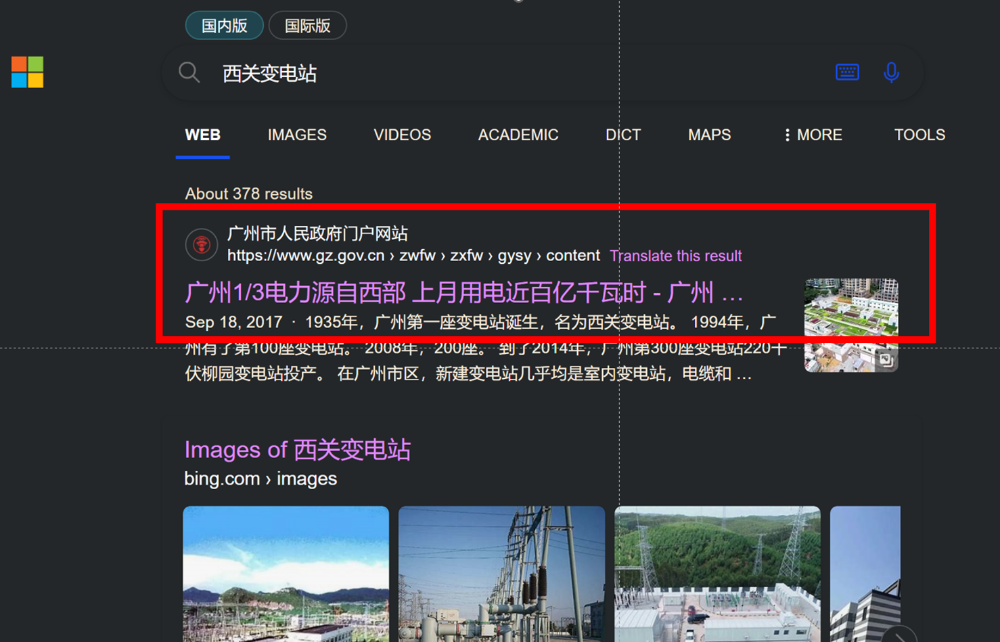
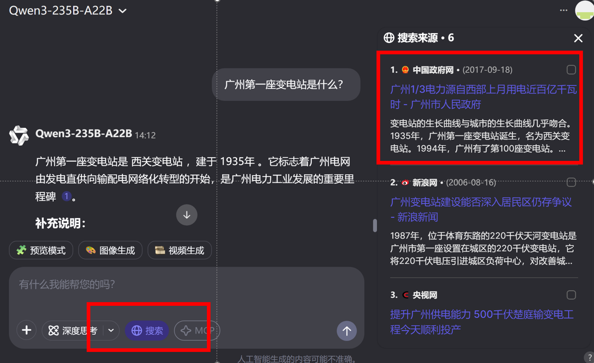
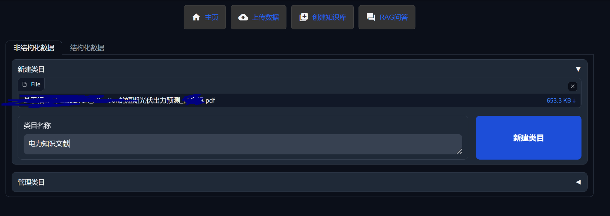
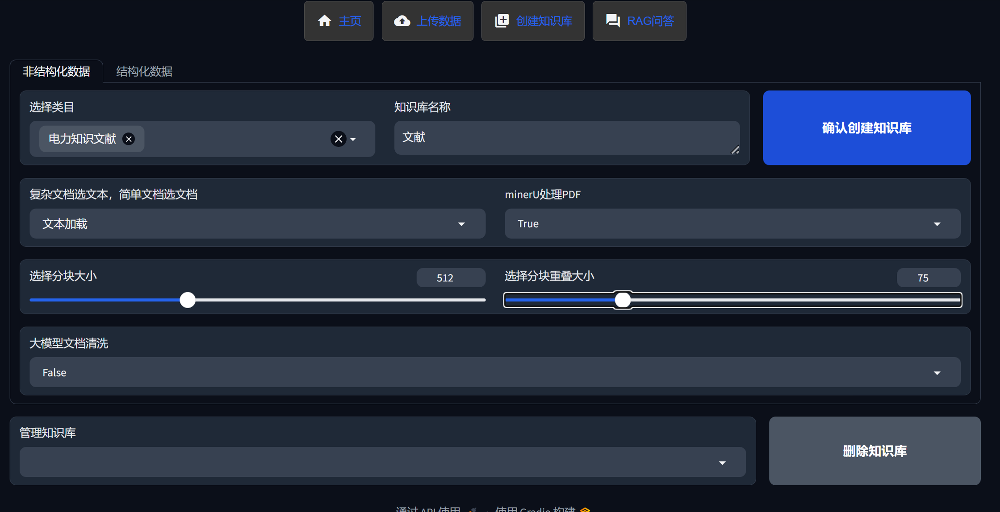
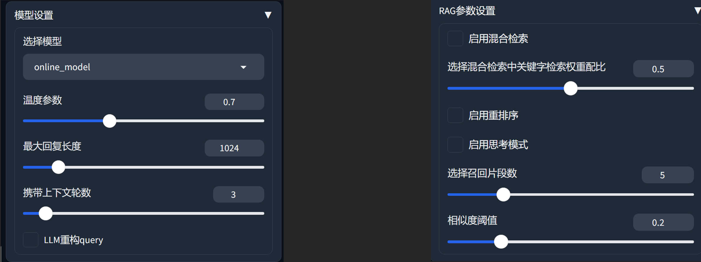
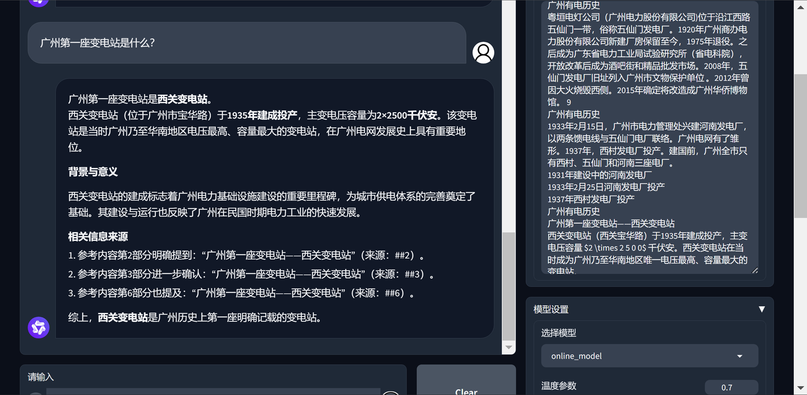

# Electrical RAG--基层配电工作领域的私有知识库



## 项目核心功能

1. 支持多种文档格式上传：支持 PDF、Word、Excel、.csv、.txt 等文档处理
2. 集成企业级文档解析器MinerU：来源于上海人工智能实验室开源项目https://github.com/opendatalab/mineru
3. 大模型数据清洗：引入大模型在文档加载后对文档进行清洗去污
4. 文档处理：基于LlamaIndex框架分割文档，转换为向量表示并存储
5. 大模型重构查询：支持通过LLM将用户query调整得更规范更利于检索
6. 混合检索：结合向量语义检索和BM25关键字检索，提高检索准确性，权重可控
7. 结果重排序：支持LLM重排序，优化相关性排序
8. 交互友好：Gradio网页界面 + FAST api接口
9. 智能问答：可接入在线大模型或者本地大模型进行本地文档的精准问答
10. 本地部署：数据不离开本地，保障信息安全
11. 支持本地Qwen3系列模型推理模式的开启与关闭


### 项目结构

```
Electrical RAG
├─ .env
├─ build_knowledge_repository  # 构建知识库
│  ├─ clean_document.py
│  ├─ create_db.py
│  ├─ file_read.py
│  ├─ md_process.py
│  ├─ minerU.py
│  └─ upload_file.py
├─ File                        # 文件上传
│  ├─ .DS_Store
│  ├─ Structured
│  └─ Unstructured
├─ html_string.py
├─ images
├─ main.py
├─ RAG_CHAT                    # RAG交互
│  ├─ chat.py
│  ├─ HybridRetriever.py
│  ├─ local_model.py
│  ├─ online_model.py
│  └─ query_reform.py
├─ README.md
├─ requirements.txt
└─ VectorStore                 # 向量数据库
```

## 项目背景

本项目来源于本人作为一位一线电力工人的真实需求。一线的工作繁杂而又琐碎，上级单位繁杂众多，九龙治水。各种培训资料、政策宣贯、安全规定、规章制度数不胜数，导致各种PPT、word、PDF文档堆积如山，过目即忘。在工作中遇到需要查阅资料时根本无从下手如大海捞针。遂想借用AI大模型的RAG技术将配电一线工作中需要用到的知识整合起来形成一个配电领域的专业知识库，在遇到工作上对政策不清晰，记忆模糊时可随时向大模型提问，以解燃眉之急。

### 现有大模型落地应用遇到的瓶颈

本人在使用大模型在行业垂直领域工作时感觉到大模型的信息准确度有所欠缺，尤其是到了行业的某一细分领域，模型的幻觉问题愈发严重。故希望采用挂载私有知识库的方式为模型添加行业细分领域的特定知识，以提高大模型在行业细分领域的表现能力。

实际应用中遇到的幻觉问题：如图所示，展示了本地部署的Qwen2.5-0.5B和最新发布的Qwen3-235B-A22B在具体到广州的电力行业知识上的具体表现。图中就“广州第一座变电站是什么？”这一问题对两种模型进行了问答，结果如图所示：






Qwen2.5-0.5B完全没有这方面的知识，答案完全是胡编乱造的。Qwen3-235B-A22B是具有这方面知识的，但是产生了一定程度的幻觉。真实答案如图所示，Qwen3-235B-A22B将1935年记成了1936年，西关记成了西村。在我们开启联网查询功能后，该幻觉得到了解决。





这仅仅只是针对广州地方电力历史知识的一次简单问答，不涉及一线电力生产工作的具体细节和具体参数。一线的电力工作要求有极高的精确性和稳定性，容不得发生失误，一但发生涉及电力的安全生产事故，小则关乎人身安全，大则威胁社会稳定。

### 工业生产环境真实落地应用的优化方案

因此，大模型在一线电力生产领域想要真正做好落地应用，还得通过RAG挂载企业本地知识库，或者借助外部工具联网搜索，亦或者通过模型微调来灌注这部分行业细分领域的知识。

## 项目展示


### 项目效果

文件上传



文档解析



模型设置、RAG参数设置



挂载知识库后的问答效果



## 使用方法

1. 创建并激活虚拟环境：
    ```
    # 使用conda创建虚拟环境
    conda create -n rag python=3.10
    conda activate rag
    ```

2. 安装依赖项:
    ```
    pip install -r requirements.txt
    ```

3. 接入大模型：在.env文件中配置本地大模型参数，目前支持Qwen3系列模型切换推理模式。同时支持OpenAI SDK的接口调用在线大模型。

4. 启动服务：

    启动Fastapi和Gradio网页界面：
    ```
    uvicorn main:app --port 7866
    ```

## 项目改进

目前本项目更多的只是一个探索中的demo，基本上都是调用的一些底层接口，偏实验探索创新性质，后续会继续优化和扩展。寻找一种更适合生产领域的解决方案。

一线的电力工作要求有极高的精确性和稳定性，容不得发生失误，一但发生涉及电力的安全生产事故，小则关乎人身安全，大则威胁社会稳定。本项目旨在通过RAG技术挂载本地知识库的方式更好地让大模型在一线生产领域落地使用。


